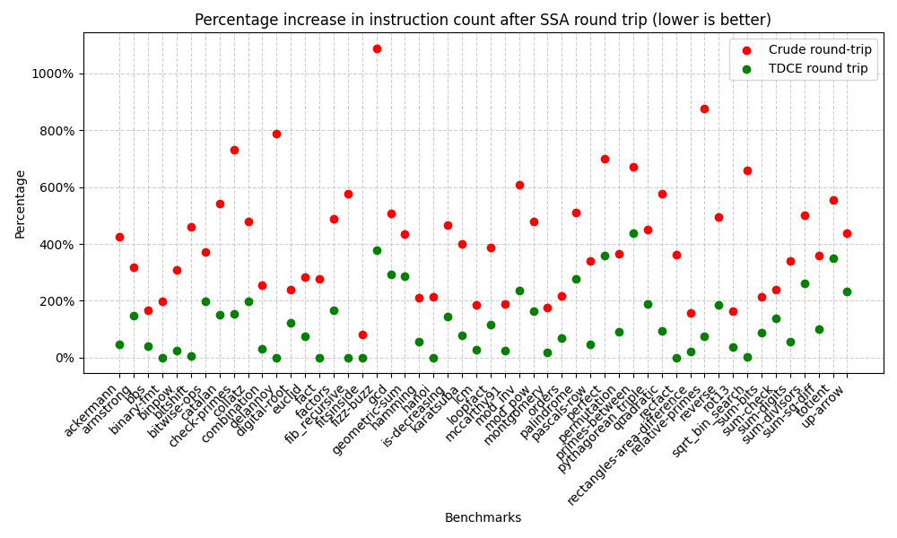

Group (@ngernest, @katherinewu312, @samuelbreckenridge)

[Code](https://github.com/katherinewu312/cs6120-tasks/tree/main/l6)

For our conversion into SSA we use the basic approach of introducing a unique copy of each variable for every basic 
block. We do not ever construct explicit phi nodes but rather iterate over basic blocks, adding the necessary `get` and 
`set` instructions to each block. To handle variables that are undefined at certain basic blocks we explicitly set all 
variables to `undef` at the beginning of the function. The trickiest part of this implementation was figuring out 
how to handle function arguments correctly. We first tried to avoid renaming function arguments at all but found 
this prevented us from fully reaching SSA form if the function argument variable name was reused as a dest in the 
function body. Instead we copy the function argument into a renamed version at the beginning of the function. 
However we found a nasty bug with this approach that caused our SSA conversion of the `core/orders.bril` benchmark to 
enter an infinite loop, because the function argument variable names were being written to, however control flow 
would pass back to the entry block and we would incorrectly copy the original function arguments back into the 
variable. To fix this, we needed to add a dummy entry block for the function argument copies. To test our conversion 
to SSA, we use Turnt to convert to SSA and then evaluate correctness of execution and whether the converted programs 
are actually in SSA. We ran these checks on both handpicked test cases based on bugs we observed and all of the Bril 
benchmarks, all of which pass.

From here, the out-of-SSA conversion was straightforward: we simply deleted all 'get' instructions and replaced all 'set x y' instructions with the instruction 'x: type = id y'. Before such deletions and substitutions we made, we first made sure to iterate through the SSA program to obtain a dictionary mapping dest (shadow) variable names to their type for those variables in the 'get' instructions. We tested our out-of-SSA implementation by performing SSA roundtrip tests. We first tested on the examples located in the `bril/examples/ssa_roundtrip` directory to verify that our outputs match with the outputs of the reference implementation. Generalizing, we then performed roundtrip tests on all core benchmarks in bril using brench, counting dynamic instructions to measure the overhead and making sure all these tests passed as well.

The scatter plot below illustrates the overhead (in terms of % increase in instruction count) after taking the program on a round-trip through SSA & back. The mean overhead from doing a crude roundtrip (no optimizations) is 413.91%, whereas if we perform TDCE (using our L3 code) after converting back to SSA, the mean overhead is reduced to 121.23%, with 8 of the 50 benchmarks having 0 overhead after the round-trip! We suspect that if we perform more optimizations (e.g. constant propagation), we could reduce the SSA round-trip overhead even more. 

